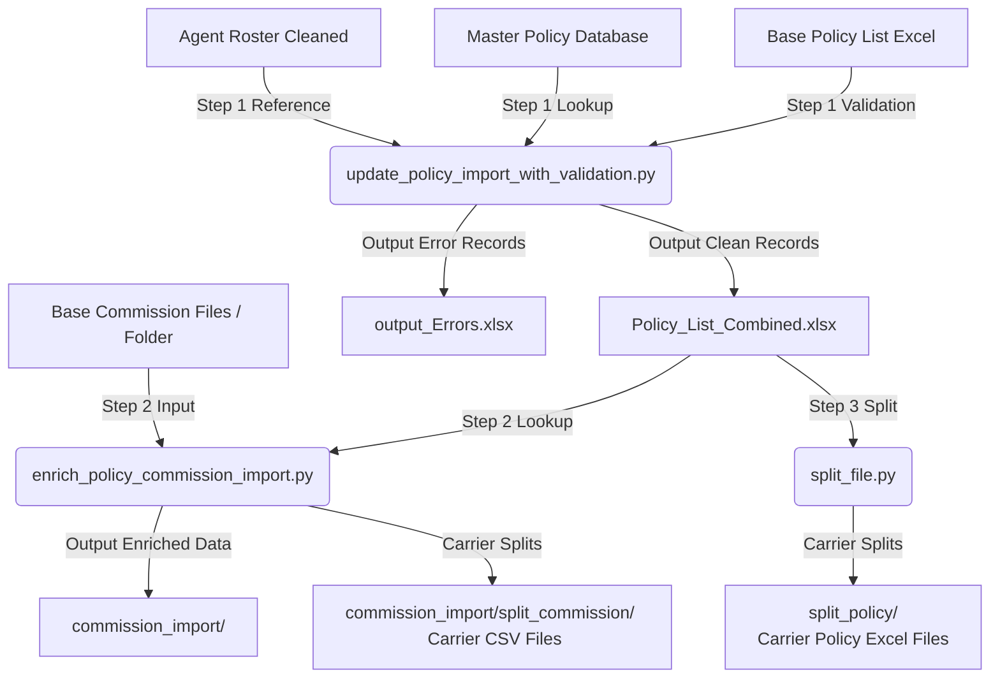

# 🚀 PieQ Policy & Commission Import Extraction Utility

An enterprise-grade Python suite for validating policy import lists, processing multi-tier agent commission splits, enriching carrier metadata, and extracting clean, deduplicated carrier import files.

---

## 📋 Executive Overview

In the insurance industry, policy list imports and carrier commission files arrive from multiple sources with missing fields, multi-agent commission splits, and carrier-level overrides. 

This repository provides an automated, end-to-end data processing pipeline that:
1. **Validates Policy Import Lists**: Matches raw policy files against Master Policy databases, populating missing metadata (`Carrier`, `LOB`, `Agent Level`, `Payment Frequency`, `Premium`) and isolating invalid records into an error file.
2. **Propagates Policy Carrier Metadata**: Automatically fills missing `Carrier` and policy attributes across all secondary agent split tiers (e.g. Sales Leader, Agency) so related policy records stay grouped together.
3. **Calculates Sequence-Based Commission Splits**: Automatically computes incremental line item amounts and relative split percentage shares (`Rate`) for multi-sequence commission structures.
4. **Tracks Benchmark Carrier Commission & Payout Method**:
   - **`Carrier Commission`**: Captures the overall benchmark value for the policy period (either total rate **`30.00 %`** or total dollar amount **`$150.00`**).
   - **`Payout Method`**: Automatically identifies whether the commission structure is **`PERCENTAGE`** (rate-based) or **`FIXED FEE`** (dollar-based).
5. **Extracts Carrier-Wise Split Files**: Automatically splits clean policy lists and commission datasets into individual carrier files (`Aetna.csv`, `Humana.csv`, `UHC.csv`, etc.).

---

## 💡 How It Works (Simplified for Business & Operations)

### Scenario A: Rate-Based Commission Split (`Payout Method = PERCENTAGE`)

#### Raw Input (Before Processing)
A single policy `CLI7115324` has 3 commission sequences with a total carrier rate of **30.0 %**:

| Sequence | Agent Name | Status | From Month | Rate *(Raw)* | Amount |
|---|---|---|---|---|---|
| 1 | MATTHEW DAUGHERTY | Active | 1 | **20.0 %** | $0.00 |
| 2 | GREG TEIPEL | Active | 1 | **25.0 %** | $0.00 |
| 3 | MAIN LINE BENEFITS | Active | 1 | **30.0 %** | $0.00 |

#### Processed Output (After Pipeline Execution)
- **`Carrier Commission`** = **30.00 %** (the overall carrier benchmark rate).
- **`Payout Method`** = **`PERCENTAGE`**
- **`Rate`** = Computed split percentage share for each line item (`66.66 %`, `16.66 %`, `16.68 %`).
- **`Carrier`** = Propagated across **all** split rows so all 3 agents stay in `Aetna.csv`.

| Policy No | Sequence | Agent Name | Agent Level | Rate *(Split Share)* | Carrier Commission *(Total Benchmark)* | Payout Method | Carrier |
|---|---|---|---|---|---|---|---|
| CLI7115324 | 1 | MATTHEW DAUGHERTY | LVL 5.00 | **66.66 %** | **30.00 %** | **PERCENTAGE** | **Aetna** |
| CLI7115324 | 2 | GREG TEIPEL | Sales Leader | **16.66 %** | **30.00 %** | **PERCENTAGE** | **Aetna** |
| CLI7115324 | 3 | MAIN LINE BENEFITS | Agency | **16.68 %** | **30.00 %** | **PERCENTAGE** | **Aetna** |

*Validation: `66.66% + 16.66% + 16.68% = 100.00%` of the **30.00 %** total Carrier Commission.*

---

### Scenario B: Dollar-Based Commission Split (`Payout Method = FIXED FEE`)

#### Raw Input (Before Processing)
When the raw file has **Rate = 0.00 %** and specifies dollar amounts:

| Sequence | Agent Name | Status | From Month | Rate *(Raw)* | Amount *(Raw)* |
|---|---|---|---|---|---|
| 1 | MATTHEW DAUGHERTY | Active | 1 | **0.00 %** | **$100.00** |
| 2 | GREG TEIPEL | Active | 1 | **0.00 %** | **$120.00** |
| 3 | MAIN LINE BENEFITS | Active | 1 | **0.00 %** | **$150.00** |

#### Processed Output (After Pipeline Execution)
- **`Carrier Commission`** = **$150.00** (total dollar amount benchmark).
- **`Payout Method`** = **`FIXED FEE`**
- **`Amount`** = Incremental line item amount (`$100.00`, `$20.00`, `$30.00`).
- **`Rate`** = Calculated split percentage share (`66.66 %`, `13.33 %`, `20.01 %`).

| Policy No | Sequence | Agent Name | Agent Level | Amount *(Line Item)* | Rate *(Split Share)* | Carrier Commission *(Total Benchmark)* | Payout Method | Carrier |
|---|---|---|---|---|---|---|---|---|
| CLI7115324 | 1 | MATTHEW DAUGHERTY | LVL 5.00 | **$100.00** | **66.66 %** | **$150.00** | **FIXED FEE** | **Aetna** |
| CLI7115324 | 2 | GREG TEIPEL | Sales Leader | **$20.00** | **13.33 %** | **$150.00** | **FIXED FEE** | **Aetna** |
| CLI7115324 | 3 | MAIN LINE BENEFITS | Agency | **$30.00** | **20.01 %** | **$150.00** | **FIXED FEE** | **Aetna** |

---

## 🏗️ End-to-End Pipeline Architecture



---

## ⚡ Quick Start & Installation

### Environment Setup

1. Clone or navigate to the repository directory:
   ```bash
   cd pieq-policy-file-import-extraction
   ```

2. Create and activate a virtual environment:
   - **macOS / Linux:**
     ```bash
     python3 -m venv .venv
     source .venv/bin/activate
     ```
   - **Windows:**
     ```bash
     python -m venv .venv
     .venv\Scripts\activate
     ```

3. Install required dependencies:
   ```bash
   pip install -r requirements.txt
   ```

---

## 🛠️ Utility Reference & Command Options Guide

### 1. Unified Pipeline Execution (`update_policy_import_with_validation.py`)

Runs Policy List Validation, Carrier Propagation, Commission Split Calculation, and Carrier Splitting in a single command.

```bash
python update_policy_import_with_validation.py \
  --base-file <base_policy_list.xlsx> \
  --master-file <master_policy_database.xlsx> \
  --output-file pipeline_output/ \
  --ref-file <agent_roster.xlsx> \
  --base-split <commission_files_folder> \
  --yes
```

#### Arguments Reference:

| Argument | Short / Alias | Required | Default | Description |
|---|---|---|---|---|
| `--base-file` | | **Yes** | N/A | Path to the base Policy List Excel file. |
| `--master-file` | | **Yes** | N/A | Path to the Master Policy Excel file. |
| `--output-file` | | **Yes** | N/A | Path where clean output Excel file or output folder will be saved. |
| `--error-file` | | No | `{output}_Errors.xlsx` | Path where error records Excel file will be saved. |
| `--fixed-error-file` | | No | `None` | Optional resolved error file to combine with clean output before Step 2. |
| `--base-split` | `--commission-file` | No | `None` | Path to base commission split CSV/Excel file or folder for Step 2. |
| `--output-dir` | | No | Same as `--output-file` dir | Directory to save Step 2 (`commission_import`) and Step 3 (`split_policy`) outputs. |
| `--base-policy-col` | | No | `Policy No` | Policy Number column name in base policy file. |
| `--master-policy-col` | | No | `Policy Number` | Policy Number column name in master policy file. |
| `--base-agent-col` | | No | `Agent Name` | Agent Name column name in base policy file. |
| `--master-agent-col` | | No | `Agent Name` | Agent Name column name in master policy file. |
| `--target-cols` | | No | `Carrier LOB "Agent Level" "Agent ID" "Pay Mode" Premium` | Space-separated list of target columns to pull from master file. |
| `--ref-file` | | No | `None` | Optional reference/mapping file (`.xlsx`/`.csv`) to update output columns. |
| `--ref-key-col` | | No | `Agent Name` | Matching key column name in reference file. |
| `--ref-val-col` | | No | `None` | Source value column in reference file (auto-discovered if omitted). |
| `--ref-target-col` | | No | Same as `--ref-val-col` | Target column in output file to update. |
| `--split-col` | | No | `Carrier` | Column to split clean policy file by in Step 3. |
| `--no-splits` | | No | `False` | Skip Step 3 carrier splitting. |
| `--yes` | `-y`, `--auto-confirm` | No | `False` | Auto-confirm prompts and proceed automatically without stopping. |

---

### 2. Commission Split Enrichment (`enrich_policy_commission_import.py`)

Processes commission files, performs sequence adjustments, populates `Carrier Commission` and `Payout Method`, and propagates Carrier across policy groups.

```bash
python enrich_policy_commission_import.py \
  --base-file <commission_file_or_folder> \
  --master-file <clean_policy_list.xlsx> \
  --output-dir pipeline_output/commission_import \
  --ref-file <agent_roster.xlsx>
```

#### Arguments Reference:

| Argument | Aliases | Required | Default | Description |
|---|---|---|---|---|
| `--base-file` | `--base-split` | **Yes** | N/A | Path to base commission CSV/Excel file OR folder containing commission files. |
| `--master-file` | | **Yes** | N/A | Path to master Excel / clean policy import file. |
| `--output-file` | | No | `None` | Output file path (if single file input). |
| `--output-dir` | | No | `commission_import` | Directory where enriched commission files and carrier splits will be saved. |
| `--ref-file` | `--reference-file`, `--agent-roster`, `--roster-file` | No | `None` | Optional agent roster / reference mapping file (`.xlsx`/`.csv`). |
| `--ref-key-col` | `--key-col`, `--roster-key-col` | No | `Agent Name` | Key column name in reference file. |
| `--ref-val-col` | `--val-col`, `--roster-val-col` | No | `None` | Source value column in reference file (auto-discovered if omitted). |
| `--ref-target-col` | `--target-col`, `--roster-target-col` | No | Same as `--ref-val-col` | Target column in output dataset to update. |

---

### 3. Unique Commission Extraction (`extract_unique_commission.py`)

Looks up Policy Numbers from Policy Import outputs against Commission Structure files, extracts unique matching commission records, removes duplicates, and exports clean carrier files.

```bash
python extract_unique_commission.py \
  --policy-input pipeline_output/Policy_List_Combined.xlsx \
  --commission-input pipeline_output/commission_import/split_commission \
  --output-dir pipeline_output/unique_commission_import
```

#### Arguments Reference:

| Argument | Aliases | Required | Default | Description |
|---|---|---|---|---|
| `--policy-input` | `--policy-file`, `--policy-dir`, `--policy-path` | **Yes** | N/A | Path to Policy Import output file (`.xlsx`/`.csv`) OR folder. |
| `--commission-input` | `--commission-file`, `--commission-dir`, `--commission-path` | **Yes** | N/A | Path to Commission Structure file (`.xlsx`/`.csv`) OR folder (e.g. `split_commission/`). |
| `--output-dir` | `--output-folder` | No | `pipeline_output/unique_commission_import` | Target directory to save unique commission import file(s). |
| `--policy-key-col` | | No | Auto-detected | Optional Policy Number column name in policy import files. |
| `--comm-key-col` | | No | Auto-detected | Optional Policy Number column name in commission structure files. |
| `--no-dedupe` | | No | `False` (Dedupe Enabled) | Disable deduplication of matching commission rows. |
| `--no-separate-unmatched` | | No | `False` (Separation Enabled) | Disable saving unmatched commission rows to `unmatched_commission/` subfolder. |

---

### 4. File & Directory Splitter (`split_file.py`)

Groups and splits any Excel or CSV file (or directory of files) by a specified column name (e.g., `Carrier`).

```bash
# Split a single file
python split_file.py -f policies.xlsx -c "Carrier"

# Split all files in a folder
python split_file.py -f pipeline_output/unique_commission_import -c "Carrier"
```

#### Arguments Reference:

| Argument | Short Flag | Required | Default | Description |
|---|---|---|---|---|
| `--file` | `-f` | **Yes** | N/A | Path to input CSV/Excel file OR directory containing files. |
| `--column` | `-c` | **Yes** | N/A | Column name to group and split by. |
| `--output-dir` | `-o` | No | `split_output` folder | Output directory to save split files. |
| `--format` | | No | `match` | Target output format (`match`, `excel`, `csv`). |
| `--sheet` | | No | `0` | Sheet name or index for Excel files. |

---

### 5. Multi-Column Duplicate Detector (`find_duplicates.py`)

Identifies and isolates duplicate records based on user-selected columns.

```bash
# Annotate duplicates on Policy Number column
python find_duplicates.py Policy_List.xlsx -c "Policy Number" --sort

# Separate clean rows and duplicate rows into distinct output files
python find_duplicates.py Policy_List.xlsx -c "Policy No" "Product" --separate
```

#### Arguments Reference:

| Argument | Short Flag | Required | Default | Description |
|---|---|---|---|---|
| `--file` (or positional) | `-f` | **Yes** | N/A | Path to input Excel (`.xlsx`, `.xls`) or CSV (`.csv`) file. |
| `--columns` | `-c` | **Yes** | N/A | One or more column names to group & check duplicates on. |
| `--sort` | `--sort-by` | No | `None` | Sorts dataset by column(s) before processing. |
| `--output-file` | `-o` | No | `{file}_duplicates.{ext}` or `{file}_clean.{ext}` | Path to save annotated or clean output file. |
| `--separate` | `-s` | No | `False` | Exports clean non-duplicates to one file and duplicate-only rows to another file. |
| `--sheet` | `-sh` | No | `0` | Sheet name or index for Excel files. |

---

### 6. File Concatenation & Stacking (`join_files.py`)

Combines multiple Excel/CSV files (such as clean outputs and fixed error files) into a single formatted file.

```bash
python join_files.py file1.xlsx file2.xlsx -o combined_output.xlsx
```

#### Arguments Reference:

| Argument | Short Flag | Required | Default | Description |
|---|---|---|---|---|
| `files` (or positional) | `-i`, `--inputs` | **Yes** | N/A | Space-separated list of input Excel (`.xlsx`, `.xls`) or CSV (`.csv`) file paths to join. |
| `--output` | `-o` | **Yes** | N/A | Path where combined output file will be saved. |

---

### 7. Effective Date & Month Range Calculation (`process_effective_date.py`)

Calculates elapsed duration from an `Effective Date` column and populates `From Month` and `To Month` ranges.

```bash
python process_effective_date.py -f policies.xlsx -c "Effective Date"
```

#### Arguments Reference:

| Argument | Short Flag | Required | Default | Description |
|---|---|---|---|---|
| `--file` | `-f` | **Yes** | N/A | Path to input Excel/CSV file OR directory of target files. |
| `--date-column` | `-c` | No | `Effective Date` | Column name for effective date. |
| `--current-date` | | No | Current system date | Reference date in `YYYY-MM-DD` format. |
| `--output-dir` | `-o` | No | `{input}_processed` | Output folder to save processed files. |
| `--in-place` | | No | `False` | Overwrite original files directly instead of creating output directory. |
| `--sheet` | | No | `0` | Sheet name or index for Excel files. |

---

## 🧪 Automated Testing

Run the full automated test suite using Python's built-in `unittest` runner:

```bash
python -m unittest discover tests
```

### Included Test Modules:
- `tests/test_enrich_commission.py`: Verifies `Carrier Commission` and `Payout Method` logic for both percentage and fixed-fee modes.
- `tests/test_extract_unique_commission.py`: Tests policy key extraction, commission matching, and deduplication.
- `tests/test_policy_import_errors.py`: Tests error separation, missing carrier handling, and validation rules.
- `tests/test_splitter.py`: Tests single-file and directory splitting logic.
