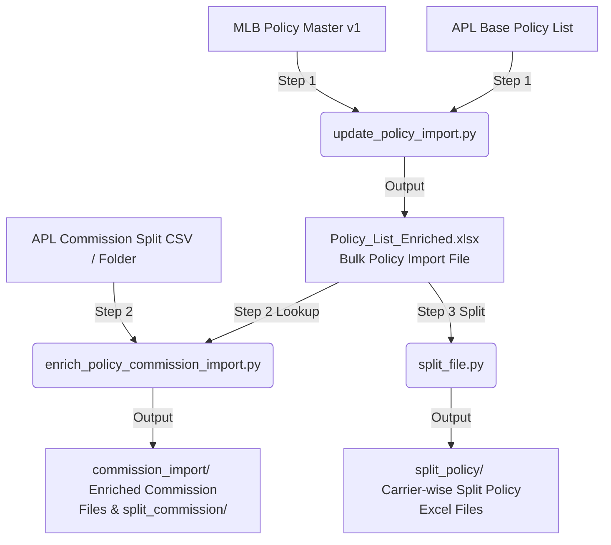

# PieQ File Import Extraction Utility

Python utility to group rows in an Excel or CSV file by a specific column and split them into separate files.

## 🌟 Unified Policy & Commission Enrichment Pipeline (`run_policy_pipeline.py`)

This utility provides a unified orchestrator script that runs the entire policy and commission enrichment process end-to-end:

### The Flow


1. **Step 1 (Bulk Policy List Enrichment)**: Takes the APL base policy list file and matches it against the MLB Policy Master file (v1) to populate columns: `Carrier`, `LOB`, `Agent Level`, `Payment Frequency`, and `Premium`. This creates the **Bulk Policy Import File** (`Policy_List_Enriched.xlsx`) and `ovr/` separated product rows.
2. **Step 2 (Commission Split Calculation & Carrier Splitting)**: Takes the APL commission split file (or directory of split files) and uses the Step 1 output file as a reference lookup. It performs sequence-based split amount adjustments and populates `Agent Level`, `Carrier`, `LOB`, etc. It outputs enriched files in `commission_import/` and generates carrier-wise split files inside `commission_import/split_commission/`.
3. **Step 3 (Carrier Splitting)**: Groups and splits **only** the Step 1 output file (`Policy_List_Enriched.xlsx`) into separate Excel files by the `Carrier` column into `split_policy/`.

### Pipeline Usage

Run the unified orchestrator script from the command line:

```bash
python run_policy_pipeline.py \
  --base-policy <apl_base_policy.xlsx> \
  --master-policy <mlb_policy_master_v1.xlsx> \
  --base-split <apl_commission_split_file_or_folder> \
  --output-dir <output_directory>
```

#### Example Command (with Real Paths)

```bash
python run_policy_pipeline.py \
  --base-policy /Users/nirmalrajaak/Downloads/file_extraction/Policy_List_0101_260728055940.xlsx \
  --master-policy /Users/nirmalrajaak/Downloads/file_extraction/policy_master.xlsx \
  --base-split "/Users/nirmalrajaak/Downloads/file_extraction/policy file 3.CSV" \
  --output-dir pipeline_output/
```

This will automatically create:
- `pipeline_output/Policy_List_Enriched.xlsx` (Step 1 enriched file)
- `pipeline_output/ovr/` (Step 1 OVR product rows file)
- `pipeline_output/split_policy/` (Step 3 directory containing carrier-wise split policy lists)
- `pipeline_output/commission_import/` (Step 2 directory containing enriched commission files)
- `pipeline_output/commission_import/split_commission/` (Step 2 subfolder containing carrier-wise split commission CSV files)

### Options

| Argument | Description | Required |
|---|---|---|
| `--base-policy` | Path to the base APL Policy List Excel file. | Yes |
| `--master-policy` | Path to the MLB Policy Master Excel file (v1). | Yes |
| `--base-split` | Path to the base APL Commission Split CSV/Excel file OR directory of files. | Yes |
| `--output-dir` | Path to save all output files and folders. | Yes |
| `--split-col` | Column to split the Step 1 output file by. Default: `Carrier`. | No |
| `--no-splits` | Skip the carrier splitting step (Step 3). | No |
| `--ref-file` | Path to optional reference/mapping file (`.xlsx`/`.csv`) to dynamically update dataset column values. | No |
| `--ref-key-col` | Key column name for reference matching (default: `Agent Name`). | No |
| `--ref-val-col` | Value column name in reference file (default: auto-discovers matching columns). | No |
| `--ref-target-col` | Target column in output dataset to update (default: same as `--ref-val-col`). | No |

## What it does

Given an input Excel/CSV file and a column name:
1. It reads the file.
2. It groups the data by the unique values in the specified column.
3. For each group, it generates a sanitized, safe filename representing that group's value.
4. It saves the grouped rows into separate files matching the input format or in the specified format (CSV/Excel).
5. Any rows with missing or blank values in the group column are preserved and written to a separate `unassigned_` file to prevent data loss.

## Setup

Navigate to the utility directory:
```bash
cd pieq-file-import-extraction
```

Create and activate a virtual environment (recommended):

**macOS / Linux:**
```bash
python3 -m venv .venv
source .venv/bin/activate
```

**Windows:**
```bash
python -m venv .venv
.venv\Scripts\activate
```

Install dependencies:
```bash
pip install -r requirements.txt
```

## Usage

Run the script from the command line using `python split_file.py` with the required parameters:

```bash
python split_file.py --file <path_to_file> --column <column_name>
```

### Options

| Argument | Short | Description | Default |
|---|---|---|---|
| `--file` | `-f` | **(Required)** Path to the input Excel (`.xlsx`, `.xls`) or CSV (`.csv`) file. | N/A |
| `--column` | `-c` | **(Required)** Name of the column to group and split by. | N/A |
| `--output-dir`| `-o` | Directory to save the split files. | A `split_output` directory next to the input file. |
| `--format` | | Target output format: `match` (same as input), `excel`, or `csv`. | `match` |
| `--sheet` | | Sheet name or index to read (only applicable for Excel files). | `0` (first sheet) |

### Example

Suppose you have an Excel file `policies.xlsx` containing rows for multiple carriers under a column named `Carrier Name`:
```bash
python split_file.py -f policies.xlsx -c "Carrier Name"
```
This splits the rows and creates a subdirectory `split_output` containing:
- `Carrier A.xlsx`
- `Carrier B.xlsx`
- `Carrier C.xlsx`

## Unique Value Extractor (`extract_unique.py`)

Extracts unique rows based on a column and outputs only the selected columns. Any rows containing missing/empty values in the target uniqueness column are isolated into a separate `unassigned` output file.

### Usage

```bash
python extract_unique.py -f <path_to_file> -c <column_name> -s <comma_separated_columns>
```

### Options

| Argument | Short | Description | Default |
|---|---|---|---|
| `--file` | `-f` | **(Required)** Path to the input Excel (`.xlsx`, `.xls`) or CSV (`.csv`) file. | N/A |
| `--column` | `-c` | **(Required)** Column name to determine uniqueness by. | N/A |
| `--select` | `-s` | Comma-separated list of output columns (e.g. `Agent Name,Agent ID,Email`). | All columns |
| `--output` | `-o` | Output file path. | `{input_name}_unique.{ext}` |
| `--sheet` | | Sheet name or index to read (only applicable for Excel files). | `0` (first sheet) |

### Example

To extract unique agent names from an agent list, keeping only the Agent Name, ID, and Email:
```bash
python extract_unique.py -f agent_list.xlsx -c "Agent Name" -s "Agent Name,Agent ID,Email"
```
This produces:
- `agent_list_unique.xlsx` (containing unique agents and the three selected columns)
- `agent_list_unassigned.xlsx` (if any rows have empty values in the "Agent Name" column)

## Column Update & Enrichment Utility (`update_columns.py`)

Matches target files or a target folder against a reference lookup Excel/CSV file on a key column and updates or inserts specified target columns.

### Usage

```bash
python update_columns.py -s <source_file> -k <key_column> -u <columns_to_update> -t <target_file_or_folder>
```

### Options

| Argument | Short | Description | Default |
|---|---|---|---|
| `--source` | `-s` | **(Required)** Path to reference lookup Excel/CSV file (e.g. `Agent_data.xlsx`). | N/A |
| `--key` | `-k` | **(Required)** Key column name to match on in reference file (e.g. `Agent Name`). | N/A |
| `--update-cols` | `-u` | **(Required)** Comma-separated column(s) from reference file to update/add in target files (e.g. `Agent ID`). | N/A |
| `--target` | `-t` | **(Required)** Path to a target file OR folder containing target files (e.g. `output/`). | N/A |
| `--target-key` | | Key column name in target file(s) if different from `--key`. | Same as `--key` |
| `--output-dir` | `-o` | Directory to save updated files. | `{target}_updated` |
| `--in-place` | | Overwrite original target files directly instead of saving to a new folder. | `False` |
| `--sheet` | | Sheet name or index for Excel files. | `0` (first sheet) |

### Example

Suppose `Agent_data.xlsx` has `Agent Name` and `Agent ID`. You want to update all files inside the `output/` folder with the `Agent ID` column matching on `Agent Name`:
```bash
python update_columns.py -s Agent_data.xlsx -k "Agent Name" -u "Agent ID" -t output/
```
This processes all files in `output/`, populates `Agent ID` based on `Agent Name`, and saves the updated files into `output_updated/` with auto-fit column widths and styled headers.

## Effective Date & Month Range Calculation (`process_effective_date.py`)

Calculates elapsed months from an `Effective Date` column relative to the current date (or reference date) and adds `From Month` and `To Month` columns.

- **1 to 12 months**: Sets `From Month` = `1`, `To Month` = `12`
- **Greater than 12 months**: Sets `From Month` = `13`, `To Month` = `""` (blank)

### Usage

```bash
python process_effective_date.py -f <input_file_or_folder>
```

### Options

| Argument | Short | Description | Default |
|---|---|---|---|
| `--file` | `-f` | **(Required)** Path to input Excel/CSV file OR directory of target files. | N/A |
| `--date-column` | `-c` | Column name for effective date. | `Effective Date` |
| `--current-date` | | Optional reference date in `YYYY-MM-DD` format. | Current system date |
| `--output-dir` | `-o` | Output folder to save processed files. | `{input}_processed` |
| `--in-place` | | Overwrite original files directly. | `False` |
| `--sheet` | | Sheet name or index for Excel files. | `0` (first sheet) |

### Example

```bash
python process_effective_date.py -f policies.xlsx -c "Effective Date"
```
This adds `From Month` and `To Month` columns to `policies.xlsx` based on the duration since the effective date and saves the formatted workbook to `policies_processed.xlsx`.

## Policy List Enrichment (`update_policy_import.py`)

Matches base Policy List Excel records with Master Policy records on `Policy No` and `Agent Name`, populating missing target columns (`Carrier`, `LOB`, `Agent Level`, etc.) from the master dataset into the enriched output Excel file.

### Usage

```bash
python update_policy_import.py --base-file <base_file> --master-file <master_file> --output-file <output_file>
```

### Options

| Argument | Description | Default |
|---|---|---|
| `--base-file` | Path to the base Policy List Excel file. | N/A (Required) |
| `--master-file` | Path to the Master Policy Excel file. | N/A (Required) |
| `--output-file` | Path where the populated output Excel file will be saved. | N/A (Required) |
| `--base-policy-col` | Policy Number column name in base file. | `Policy No` |
| `--master-policy-col` | Policy Number column name in master file. | `Policy Number` |
| `--base-agent-col` | Agent Name column name in base file. | `Agent Name` |
| `--master-agent-col` | Agent Name column name in master file. | `Agent Name` |
| `--target-cols` | Space-separated target columns to pull from master file. | `Carrier LOB "Agent Level" "Pay Mode" Premium` |
| `--ref-file` | Optional reference/mapping file (`.xlsx`/`.csv`) to update output columns. | `None` |
| `--ref-key-col` | Matching key column in reference file. | `Agent Name` |
| `--ref-val-col` | Source value column in reference file. | Auto-discovered |
| `--ref-target-col` | Target column in output file to update. | Same as `--ref-val-col` |

### Example

```bash
python update_policy_import.py --base-file Policy_List.xlsx --master-file policy_master.xlsx --output-file Policy_List_Enriched.xlsx
```
This normalizes policy numbers and agent names across both files, matches base records against the master dataset, populates `Carrier`, `LOB`, and `Agent Level`, and displays an execution summary along with a complete Carrier & LOB breakdown table.

## Policy Sequence Adjustment & Enrichment (`enrich_policy_commission_import.py`)

Processes a base CSV and a master Excel file, performs sequence-based amount adjustments within Policy/From Month groups, populates `Agent Level` from the master file using a composite lookup, and saves the final result.

### Processing Logic
1. Groups records by **Policy No** and **From Month**.
2. For rows in each group where **Amount > 0**:
   - For Sequence $S > 1$: `New Amount = Amount(Seq S) - Original Amount(Seq S - 1)` (if Sequence $S - 1$ exists in the group).
   - For Sequence $S = 1$ or if Sequence $S - 1$ does not exist: leaves the amount unchanged.
3. Original amount values are preserved and used for all sequence subtractions in a group.
4. Matches records against the master file using a composite key: **Policy No** + **Product** + **Agent Name**. If matched, populates the **Agent Level** column.

### Usage

```bash
python enrich_policy_commission_import.py --base-file <base_file> --master-file <master_file> --output-file <output_file>
```

### Options

| Argument | Description | Default |
|---|---|---|
| `--base-file` | Path to the base CSV file. | `/Users/nirmalrajaak/Downloads/file_extraction/policy file 3.CSV` |
| `--master-file` | Path to the master Excel file. | `/Users/nirmalrajaak/Downloads/file_extraction/policy_master.xlsx` |
| `--output-file` | Path to save the enriched output CSV file. | `/Users/nirmalrajaak/Downloads/file_extraction/policy_file_3_enriched.csv` |

### Example

```bash
python enrich_policy_commission_import.py \
  --base-file "policy_file_3.CSV" \
  --master-file "policy_master.xlsx" \
  --output-file "policy_file_3_enriched.csv"
```

## Running Tests

To run the automated test suite, use Python's built-in `unittest` runner:
```bash
python -m unittest discover tests
```


